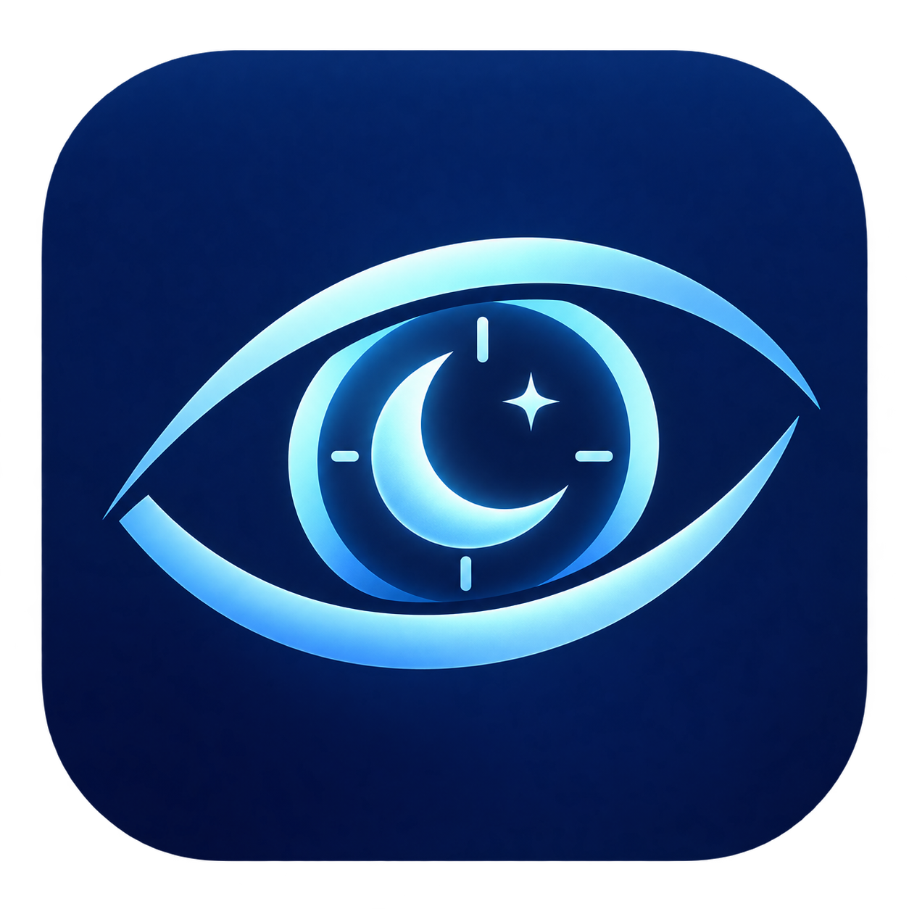
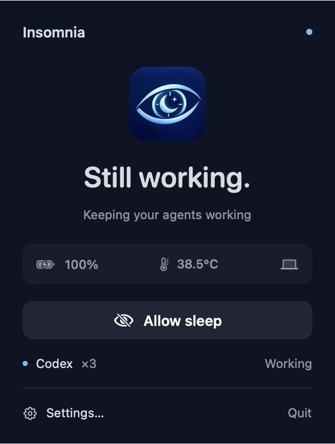
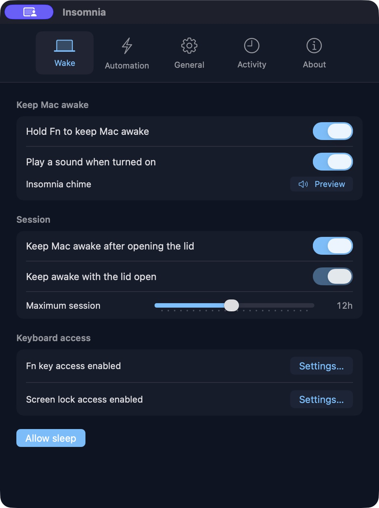

<p align="center">
  
</p>
<h1 align="center">Insomnia</h1>
<p align="center">Let your Mac work. Let yourself rest.</p>
<p align="center">Native macOS · No account · No telemetry · Free and open source</p>

Insomnia lives in your menu bar and keeps your Mac awake for long-running jobs, downloads and coding agents. Start a timed session, hold Fn, or let connected agents manage their own sessions.

**Release status:** release preparation is local. A public download will follow physical closed-lid verification. macOS 14+; tested locally on Apple silicon. Intel hardware is unvalidated. Closed-lid control uses a private macOS interface, so verify it after macOS updates.

<p align="center"></p>

## A little eye on your work

- **Filled eye:** keeping your Mac awake. **Crossed-out eye:** sleep allowed.
- Click the eye for the session panel. Right-click for quick actions.
- **Keep Mac awake** starts a session; **Allow sleep** restores normal sleep.
- Choose 15 minutes, 30 minutes, 1, 2 or 4 hours, or use the maximum-session limit.
- Battery, battery-temperature and thermal-pressure guards stop a session when needed.
- Optional Fn activation, screen locking on lid close, custom chime and launch at login.
- Claude Code, Codex, Cursor and OpenCode lifecycle connections support concurrent agent sessions. Agent completion only ends sessions started by automation.
- A separate watchdog restores power behavior if the app stops, hangs or loses its helper.

<p align="center"></p>

## Install

The local release package is Developer ID signed, notarized by Apple, and stapled. It is being held for physical closed-lid verification before publication. Until it is published, build from source:

1. Install Xcode Command Line Tools if needed: `xcode-select --install`.
2. Clone this repository into a local development folder and run:

```sh
./scripts/build.sh
```

3. Move `build/Insomnia.app` into Applications using Finder, then open it. If an app with that name already exists, check that it is this menu-bar app before replacing it. Insomnia is unrelated to the API client with the same name.

The app has no terminal requirement after installation. Locally built apps use an available Developer ID signature or an ad-hoc signature. macOS may require you to review an unnotarized build in Privacy & Security; do not disable Gatekeeper or remove quarantine.

For an installation prompt you can give a coding agent, see [Install with an agent](docs/install-with-agent.md). The prompt refers to the intended public repository and should be used once that repository is published.

## Permissions

Manual sessions work without extra permissions. Enable these only if you want their features:

| Permission | Feature | Where |
| --- | --- | --- |
| Input Monitoring | Hold Fn to keep awake | Settings → Wake → Keyboard access |
| Accessibility | Screen lock when the lid closes | Settings → Wake → Keyboard access |

The buttons open the relevant System Settings page. macOS owns the approval; the app cannot enable these permissions for you. The screen can be locked while a job continues to run.

## Connect coding agents

In **Settings → Automation**, choose Connect beside an agent and restart it. Codex additionally requires reviewing and trusting the definitions through `/hooks`. Insomnia never approves an agent's permission requests. Allow sleep pauses automatic reactivation until current agent sessions are inactive.

Existing hook configurations are backed up and merged; Disconnect removes Insomnia's handlers. Keep the app in Applications so the executable path stays stable. Connections must be refreshed if you move it. Only agent name, session ID, state and timestamp are retained—never prompts, source code, tool arguments or transcripts. Events older than one minute are ignored.

The bridges follow [Claude Code hooks](https://code.claude.com/docs/en/hooks), [Codex hooks](https://developers.openai.com/codex/hooks), [Cursor hooks](https://cursor.com/docs/hooks), and [OpenCode plugins](https://opencode.ai/docs/plugins/). Live vendor sessions still need validation for each installed version. Cursor approval-wait detection is not implemented. Manual sessions cover tools without a suitable lifecycle bridge.

## Check closed-lid behavior

Use a hard, ventilated surface; never keep an awake Mac in a bag. Disconnect external displays. Start a job that writes timestamps, choose Keep Mac awake, close the lid for 60 seconds, then reopen it and confirm the log has no interruption. Repeat on AC and battery. A locked screen or successful API call does not prove the Mac stayed awake. No temperature limit guarantees physical safety.

## Development

```sh
swift test
./scripts/build.sh
# Quit Insomnia before this hardware cleanup check:
./scripts/verify-runtime.py
```

No third-party runtime dependencies. Open `Package.swift` in Xcode. [Architecture and limits](docs/architecture.md), [verification](VERIFICATION.md), [release workflow](docs/releasing.md), and [contributing](CONTRIBUTING.md) explain the implementation and checks.

## Troubleshooting

- **Can't start a session:** read the panel message. Required missing sensors prevent waking; check General → Safety. Desktop Macs may not expose battery sensors.
- **Agent doesn't activate it:** restart the agent, verify its hooks are loaded/trusted, and confirm Insomnia is running. A connection button only confirms configuration is installed.
- **Fn doesn't respond:** grant Input Monitoring and follow any macOS restart prompt.
- **Screen doesn't lock:** enable Accessibility from Wake settings. Permissions are tied to the installed signature.
- **Unexpected sleep:** check timers, safety limits, the stay-awake-after-opening setting and recent Activity. Avoid running another lid-control app alongside Insomnia.

## License

[MIT](LICENSE). An independent implementation inspired by StillOn; no original binary or commercial licensing code is distributed. Icon created with AI; chime generated for this project.
